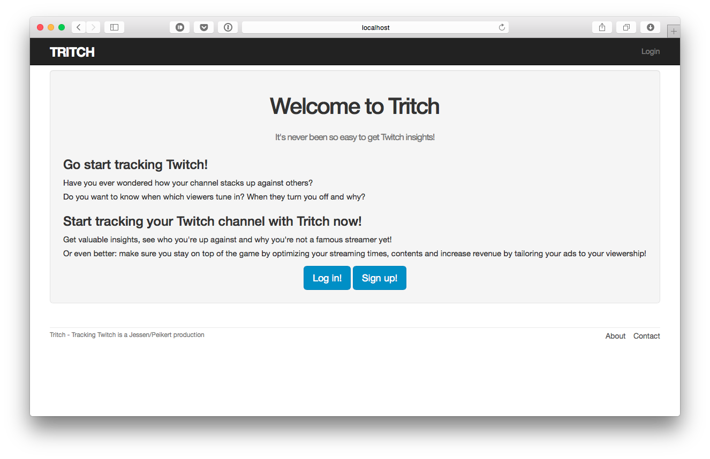

# Tritch
## Tracking Twitch
Tracking Twitch will allow users to track their channels and get valuable instights. It will also provide an overview of the most popular channels / games / streamers over time.
This way Twitch streamers will be able to optimize their streaming to best suit their viewers.

Continuous async Api Querying will probably be done using [Sidekiq](http://sidekiq.org/)
DB could be relational, for the time being we will use the default rails sqlite3 database.

##Mantra: Skinny everything!
* Thin controllers, thin models, reusable layers in between.
* Keep routes clean! If I look at a route, I instantly want to know what's going on!
* Use use_case classes and helper methods with expressive names to keep a route slim.
* [DRY](https://en.wikipedia.org/wiki/Don%27t_repeat_yourself) out your shit!
* [Single responsibility](https://en.wikipedia.org/wiki/Single_responsibility_principle) works for methods as well!
  * When you got single responsibility methods, you can toss your comments by just giving everything expressive names!